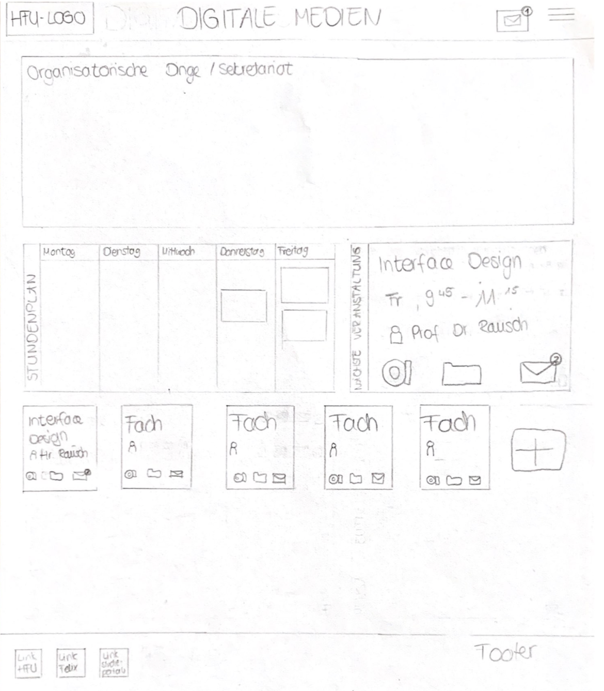
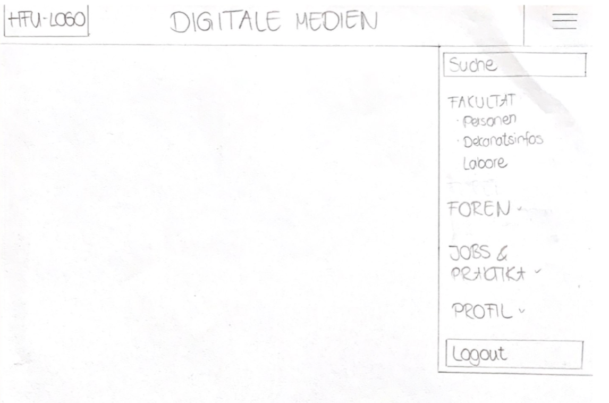
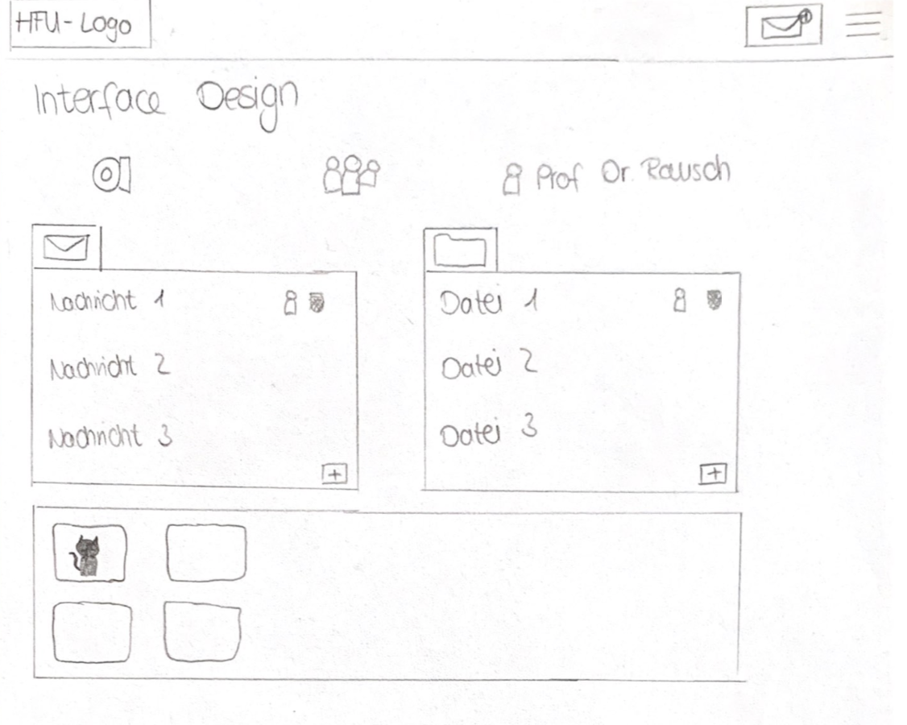
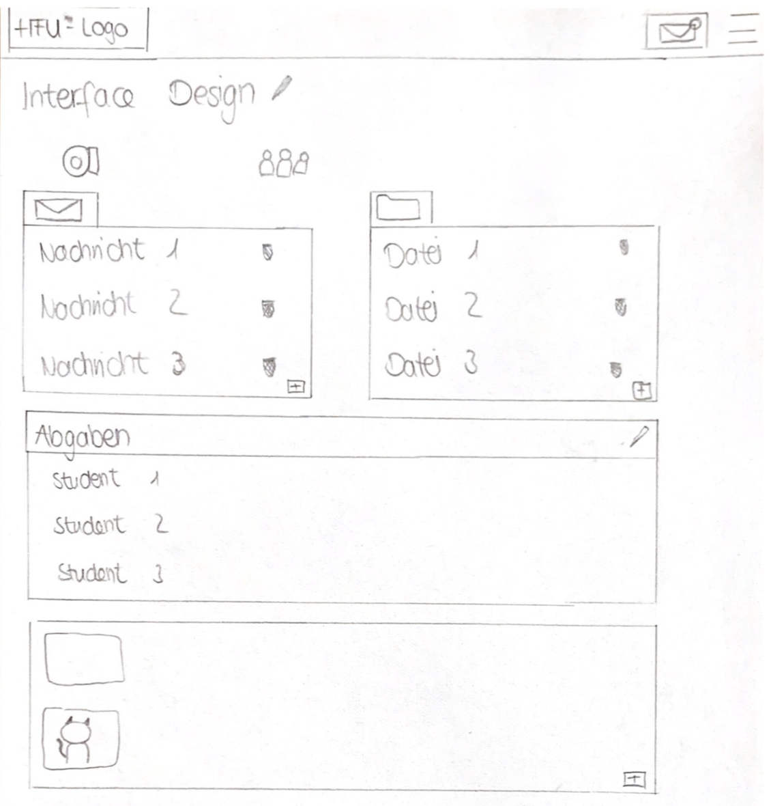

# Konzeptentwurf DM Intranet

### Einloggen
- Design der Seite an das Design der offiziellen HFU Homepage angepasst (schlicht und in Grüntönen gehalten)
- großes Header mit Schriftzug Digitale Medien (Bild eventuell I-Bau)
- wichtigste Verlinkungen zu allen HFU-Seiten (Homepage, Felix, Studieportal)
- Verlinkung zu Instagram/Facebook

### Startseite/Dashboard
- direkter Zugang zu den Mails in der Navbar
- Aktuelle wichtige Informationen oben angepinnt (Organisatorische Dinge)
- Stundenplan mit Wochenübersicht 
- Rechts Ansicht der nächsten Veranstaltung mit Direktlink zu Alfaview, Dateien und Nachrichten
- Übersicht aller gebuchten Veranstaltungen mit Direktlink zu dem Professor/Lehrbeauftragten, Dateien, Nachrichten, Alfaviewraum
- durch das "+" können weitere Veranstaltungen hinzugefügt werden
- im Footer sind nochmal die wichtigen Verlinkungen zu Felix und Studieportal aufgefasst

- Ausklappbares Burger-Menu in der Navbar
- Suchfunktion 
- alle weiteren wichtige Rubriken aufgelistet
- Rubriken können für Unterrubriken ausgeklappt werden

### Kursseite Studierende
- Navbar bleibt bestehen
- Name der Veranstaltung
- Direktlink zu Alfaview, Teilnehmer sowie zu dem Professor/in

#### Aufteilung in Kacheln 
#### 1 + 2 Kachel: Nachrichten/ Dateien
- neuste Nachrichten/Dateien werden angezeigt, sowohl von dem Professor als auch von Mitstudierenden
- durch das Plus haben auch die Studierenden die Möglichkeiten, Nachrichten bzw. Dateien an den gesamten Kursverteiler zu senden

#### 3 Kachel: Tools
- Links zu andere Tools wie beispielsweise GitHub oder Google Drive die in der Vorlesung benutzt werden, können hier hinzugefügt werden

### Kursseite Lehrende

- Aufbau ähnlich zu der Kursseite der Studierenden
- Lehrende kann alle Nachrichten/ Dateien bearbeiten

#### zusätzliche Kächel: Tools
- Studierende können beim Hochladen von Dateien die Funktion "Abgabe" auswählen. Dadurch wird die Datei nur dem Lehrenden übermittelt 
- durch "+" kann der Lehrende weitere Tools hinzufügen

