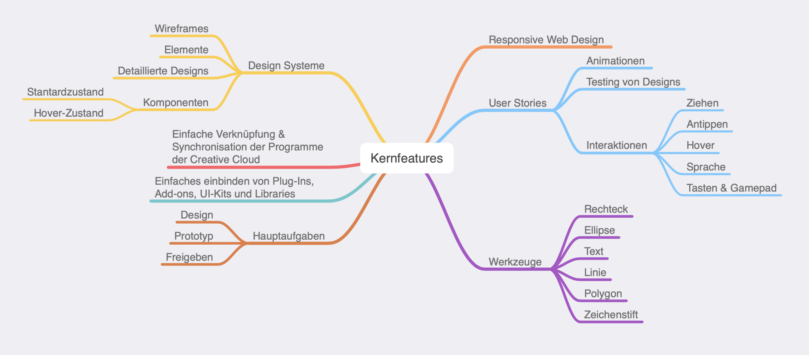
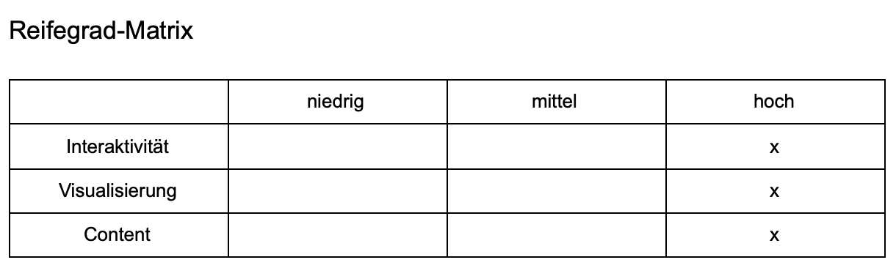
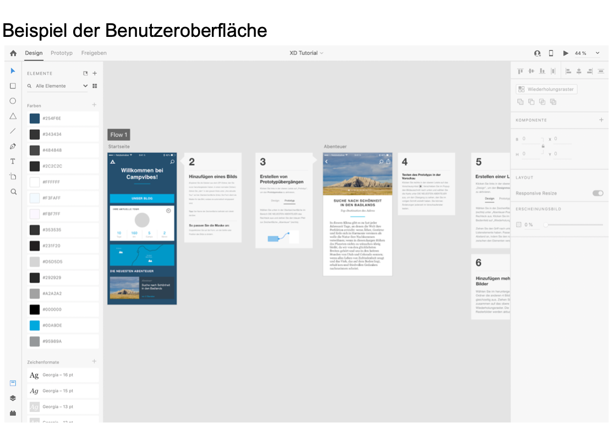

# Aufgabe 2.1: Vorstellung des Prototyp-Tools Adobe XD

erstellt von [Patrick Neudert](https://github.com/Patrickneudert) und [Pia Zeller](https://github.com/piazeller)

## Allgemeine Beschreibung

Adobe XD ist ein Teil der Creative Cloud und kann als Basisversion von jeder Privatperson kostenfrei genutzt werden. Es kann sowohl als Prototyping-Tool als auch als Screendesign-Tool verwendet werden. Zudem besticht Adobe XD durch die einfache Verknüpfung mit anderen Adobeprodukte der Creative Cloud. 

## Fidelity

Das Prototyping-Tool Adobe XD von Adobe kann sowohl für Low Fidelity als auch für High Fidelity Zwecke benutzt werden. Aufgrund der großen Bandbreite an Features und zusätzlichen Add-Ons/ Plug-ins von verschiedenen Anbietern wie Slack, Dribbble oder Font Review lassen sich diverse Prototypen, Screendesigns oder auch einfache Click-Dummys im handumdrehen erstellen. Das Tool überzeugt auch durch die einfache Handhabung und der spielerisch leichten und aufgeräumten Benutzeroberfläche, die nur auf das wesentliche reduziert ist. Darüber hinaus ermöglicht das Tool, das Teilen von einzelnen Projekten und eine Zusammenarbeit mit anderen Projektbeteiligten. Dadurch ermöglicht es allen Beteiligten Einsicht in die CSS-Eigenschaften. Mithilfe von Adobe XD können demnach Prototypen wie auch Screendesigns mit hohem Reifegrad erstellt werden. Hierunter zählen Webanwendungen inklusive diverser Animationen und Interaktionsmöglichkeiten. Diese Funktionalitäten sind jedoch für den Benutzer optional.  Aus diesem Grund ist  das Screendesign und Prototyping-Tool von Adobe bestens für High-Fidelity Prototypen geeignet und glänzt durch einen hohen Reifegrad (Content, Visualisierung und Interaktivität).  

## Beispiel der Benutzeroberfläche

Die Benutzerfläche von Adobe XD ist folgendermaßen aufgebaut:
Es gibt zwei verschiedene Arbeitsumgebungen mit getrennten Aufgabenbereichen: Screendesign und Prototyping 

### Screendesign: 
Im Screendesign lassen sich Zeichenflächen, Objekte, Bilder, Texte, Effekte und Layouts erstellen und einbetten. Es gibt eine Vielzahl von nützlichen Werkzeugen die zur visuellen Darstellung des gewünschten Designs verhelfen wie zum Beispiel der Color-Picker.

### Prototyping:
Das Prototyping Tool dient zum Erstellen von interaktiven Prototypen und Animationen. Hierbei können Funktionen, wie die Bedienung mit Tasten-/ Gamepad-Nutzung, Sprachsteuerung, Audiowiedergabe hinzugefügt werden. Weitere Funktionalitäten, die das Design ausschmücken sind zeitgesteuerte Übergange, Overlays oder 3D-Transformationen. 

[Video: Interaktion](https://drive.google.com/file/d/1J_ISmX1puIsDQr5o-_Fm88OJzrhq9Mom/view)

[Video: Erstellung eines Hover-Effekts](https://drive.google.com/file/d/1jDglyrhFW2eA7FolqM6e6os3uY636ExV/view)

## Beispiel 
#### Blind MeetUp
Wireframe und Prototyp einer Landingpage  (Projektstudium - Betreuer: Prof. Dr. Rausch)
#### Ligue
eine Landingpage aus der Veranstaltung RWD von Pia Zeller 
#### Stories out of the Box
eine Landingpage aus der Veranstaltung RWD von Patrick Neudert

## Komplexität von Adobe XD

Adobe XD ist ein recht übersichtliches und intuitives Prototyping-/Screendesign-Tool. Der klare Aufbau mit der Reduzierung auf die wichtigsten Elemente überzeugt im Umgang und beim Arbeiten mit dem Programm. Die Shortcuts ermöglichen ein schnelles und präzises Arbeiten. Durch die Möglichkeit der Erweiterung mit anderen Programmen und Dienstleistern wie beispielsweise Plug-Ins oder APIs (Anwendungsschnittstelle) steigt die Komplexität des Programms mit den Benutzerwünschen. Der Aufbau von Adobe XD ist sehr ähnlich wie bei alternativen Tools, zum Beispiel Sketch. Das ermöglicht dem Nutzer einen einfachen und reibungslosen Umstieg auf das neue Tool, ohne sich an eine neue Arbeitsatmosphäre gewöhnen zu müssen.  

## Einschränkungen

Adobe XD ist im Vergleich zu anderen Tools recht “jung” auf dem Markt und daher noch nicht weit verbreitet. Viele Unternehmen arbeiten auch heute noch mit kostenpflichtigen Varianten und haben den Umstieg auf Adobe XD noch nicht gewagt. Selbst die Ansicht eines Projektes das von externen Partner mit Adobe XD umgesetzt wurde, erfordert von dem Auftraggeber einen entsprechend eingerichteten Benutzeraccount. 
Ursprünglich wurde die Anwendung für Apple Geräte entwickelt. Für Windows-Geräte ist Adobe XD erst ab Windows 10 erhältlich und weist auch hier noch kleine Einschränkungen auf. 

## Fazit aus der Perspektive eines Studenten:
Aus der Sicht von Studenten ist Adobe XD eine sehr attraktive Anwendung, da sie kostenlos zur Verfügung steht. Zusätzlich ist die Benutzeroberfläche einfach und intuitiv zu bedienen. Darüber hinaus gibt es eine Vielzahl von kostenlosen Tutorials, die beispielsweise auf den Sozialen Netzwerken wie Youtube zur Verfügung stehen. Mit Hilfe dieser kann man sich das Wissen und Arbeiten im Umgang mit der Screendesign/Prototyping-Anwendung im Selbststudium beibringen. Dank der unterschiedlichen Add-ons und Plugins können die Werkzeuge der kostenlosen Variante erweitert werden, wodurch die Komplexität und Umsetzungsmöglichkeiten gesteigert werden. 

Während unseres Praxissemesters haben wir die Erfahrung gemacht, dass große etablierte deutsche Firmen, jedoch eher auf kostenpflichtige Anwendungen wie Sketch etc. zurückgreifen. Ein Grund hierfür ist die langjährige Zusammenarbeit mit allen Projektbeteiligten und externen Firmen an den bereits bekannten Programmen. Ein Umstieg auf Adobe XD müsste hier firmenübergreifend stattfinden. 

