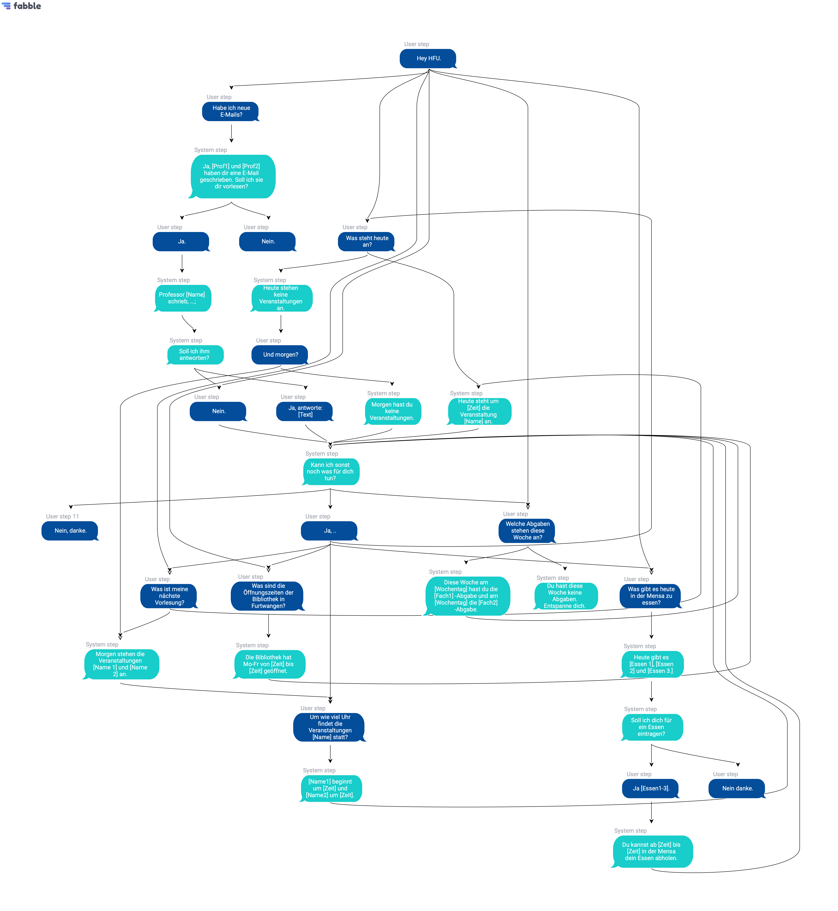

# Aufgabe 04 - VUI Konzeptentwurf

### Dokumentation
- das VUI soll den Alltag der Studierenden erleichtern. Mit Hilfe des Sprachassistenten ist es für die Studierende möglich, nebenbei schnell und einfach Informationen rund um ihr Studium abzufragen
- es bietet die Möglichkeit der Auskunft über den Studiengang, die anstehenden Wochenaufgaben sowie Zugriff auf alle Informationen der HFU
- der Studierende kann es leicht mit den Wörtern "Hey HFU" triggern, daraufhin eine Frage stellen und der VUI gibt Auskunft
- nach Beendigung eines Dialoges kommt es zu einer erneuten Abfrage seitens des VUI "Kann ich sonst noch etwas für dich tun". Antwortet der Studierende mit einer Verneinung bzw. gar nicht darauf, geht der VUI zurück in den Ruhemodus

### Vorschau

