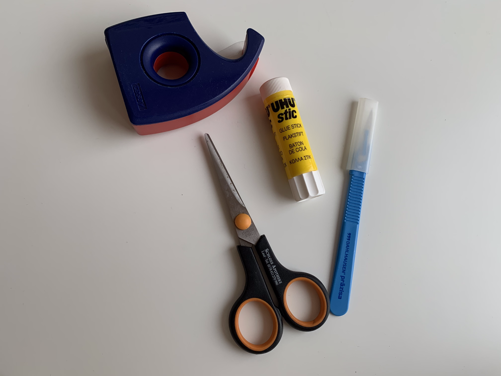

# Aufgabe 08 -  Mixed Reality + HMD (Cardboard) 

### Bereitlegen aller Materialen
- Klebestift
- Tesa
- Schere
- Skalpell 
- Versandkarton
- Vorlage VR-Brille

### 1. Schritt: 
- ausschneiden der Vorlage

### 2. Schritt: 
- aufkleben der Vorlage auf einen Versandkarton

### 3. Schritt: 
- erneutes ausschneiden der Vorlage
- kleine Aussparungen mit einem Skalpell ausschneiden

### 4. Schritt: 
- einsetzen der Linsen
- zusammenfalten der Teile zu einer VR-Brille
- Kanten zusätzlich mit Tesa fixieren

### 5. Schritt: 
- Design der VR-Brille wählen 
- Assoziation zum Schwarzwald: Tannenwald
- Gegenüberstellung von Natur durch den Tannenwald und Technologie der VR-Brille
- Fotos auf die VR-Brille kleben

### Probleme:
- Versandkarton zu dick
- Handy ist zu groß für die Vorlage